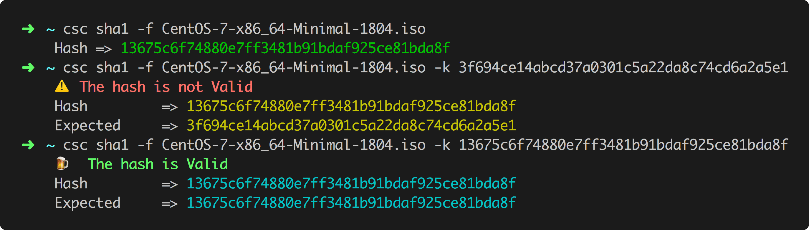

# CheckSumChecker CLI


This application allows to calculate file checksum, to check them and this for different formats like :
[md5, sha1, sha256, sha512, pgp]

## Usage

```bash
$ ./csc help
This application allows to calculate file checksum,
to check them and this for different formats like :
[md5, sha1, sha256, sha512, pgp]

Usage:
  CheckSumChecker [command]

Available Commands:
  help        Help about any command
  md5         Application to check file md5 checksum
  pgp         Application to check file pgp checksum
  sha1        Application to check file Sha1 checksum
  sha256      Application to check file Sha256 checksum
  sha512      Application to check file Sha512 checksum

Flags:
  -f, --file string   Path of the hash file
  -h, --help          help for CheckSumChecker
  -k, --key string    Expected key
```

## Example


